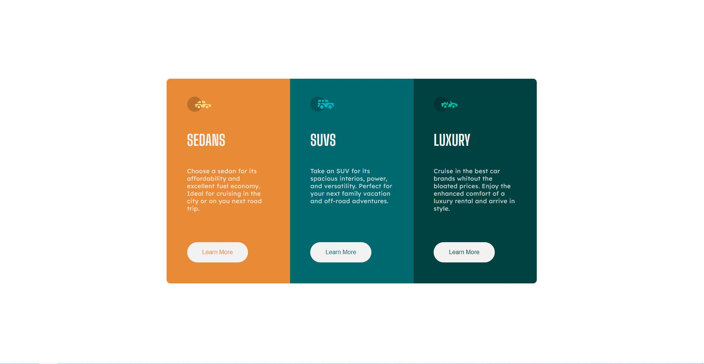

# Frontend Mentor - 3-column preview card component solution

This is a solution to the [3-column preview card component challenge on Frontend Mentor](https://www.frontendmentor.io/challenges/3column-preview-card-component-pH92eAR2-). Frontend Mentor challenges help you improve your coding skills by building realistic projects. 

## Table of contents

- [Overview](#overview)
  - [The challenge](#the-challenge)
  - [Screenshot](#screenshot)
  - [Links](#links)
- [My process](#my-process)
  - [Built with](#built-with)
  - [What I learned](#what-i-learned)

## Overview

### The challenge

Users should be able to:

- View the optimal layout depending on their device's screen size
- See hover states for interactive elements

### Screenshot




### Links

- Solution URL: https://github.com/Jonata-tr/3ColumCard
- Live Site URL: https://3-colum-card-three.vercel.app

## My process

### Built with

- Semantic HTML5 markup
- CSS custom properties
- Flexbox
- CSS Grid
- Mobile-first workflow
- [React](https://reactjs.org/) - JS library

### What I learned

Learned a lot about React flow during the process of writing the code.

I'm really happy with this little bit of code:

```jsx
const [colorB, setColor] = useState(false)

<div>
  <button 
  style={{
    color: colorB === true ? "#fff" : det.buttonText,
    backgroundColor: colorB === true ? det.buttonText: ""
  }
  }
  onMouseEnter={() => {setColor(true)}}
  onMouseOut={() => {setColor(false)}}  
  >Learn More</button>
</div>
```

